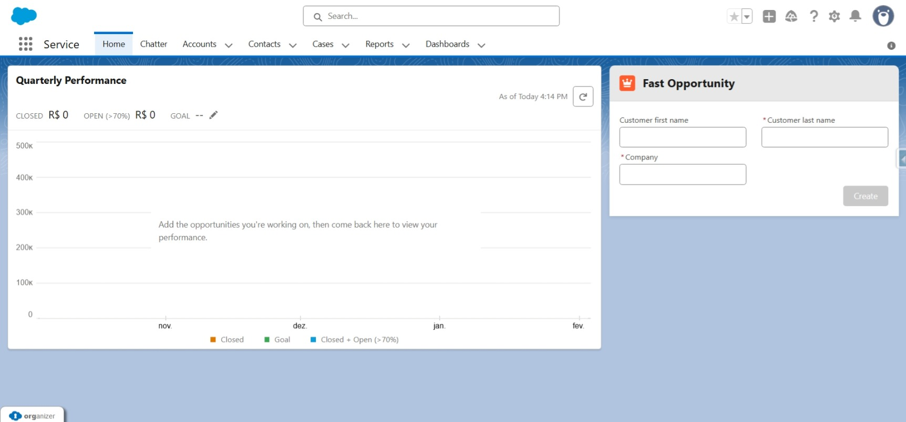

## 🚀 FastOpportunity LWC: Convert Leads to Full Records in a Flash!

### ✨ Overview & Value Proposition

The **FastOpportunity** Lightning Web Component (LWC) is designed to dramatically improve sales efficiency by offering a **one-click solution** to process qualified Leads. This component completely bypasses the standard, multi-step Salesforce conversion process, allowing users to instantly create a new **Account**, **Contact**, and **Opportunity** record simultaneously from any Lead.

> **Focused on Efficiency:**
> By streamlining the conversion process, this component minimizes the time Sales Reps spend on administrative tasks, accelerates the sales cycle, and ensures data consistency across Account, Contact, and Opportunity objects immediately.

### 💰 Cost-Effective Adoption: The Experience Cloud Advantage

This LWC offers a significant architectural benefit, especially for organizations leveraging **Salesforce Experience Cloud (Portals/Communities)**.

In many scenarios, partners, agents, or external users who only need to manage Leads and convert them into Opportunities do not require a full **Sales Cloud** license.

* **License Optimization:** By placing this custom LWC on an Experience Cloud page (using an appropriate license like **Partner Community** or **Customer Community Plus**), organizations can enable critical Lead-to-Opportunity conversion functionality for external users.
* **Decoupling from Standard UI:** The custom Apex/LWC logic avoids relying on the standard Salesforce Lead Conversion UI, which often requires a full Sales Cloud license to be accessed and used effectively.
* **Scalable Solution:** This approach allows companies to expand their conversion capabilities to high-volume external users without the prohibitive cost associated com full CRM User licenses.

### 💡 Key Features

* **Instant Conversion:** Convert a Lead into Account, Contact, and Opportunity with a single click.
* **Experience Cloud Ready:** Built and configured to support **External User Profiles** for use in Experience Cloud Sites.
* **Default Mapping:** Pre-populates essential fields for the new records (Account, Contact, Opp) based on the Lead data.
* **Customizable:** Easily adapted to include specific custom fields required by your organization (e.g., custom revenue fields on the Opportunity).
* **Modern UX:** Built with native Salesforce LWC for a fast, responsive, and seamless user experience.

### ⚙️ Installation and Setup

#### 1. Deployment

1.  Clone this repository:
    ```bash
    git clone https://github.com/fabricio-smarg/fastOpportunity.git
    ```
2.  Deploy the component to your Salesforce Org using Salesforce CLI (SFDX):
    ```bash
    sf project deploy start --manifest .\\src\\package.xml
    ```

#### 2. Component Placement

The `FastOpportunity` LWC is designed to be placed directly onto the **Lightning Home Page** (for internal users) or an **Experience Cloud Page** (for external users).

1.  Open any home page or the desired Experience Cloud Page in Builder.
2.  Click the gear icon (⚙️) and select **Edit Page** or open the **Experience Builder**.
3.  Drag the `fastOpportunity` component from the Custom Components list onto the page.
4.  **Save** and **Activate** the page.

### 🔧 Usage

Once deployed and configured, a user can:

    1.  Fill the qualified Lead information.
    2.  Click the **Create** button provided by the `FastOpportunity` component.
    3.  The LWC will execute the Apex logic to create the Account, Contact, and Opportunity records, then navigate the user to the newly created Opportunity.

### 💻 Code Details

* **LWC (`fastOpportunity.js`, `.html`, `.xml`):** Handles the user interface, button click, and communication with Apex.
* **Apex Controller (`FastOpportunityController.cls`):** Contains the core business logic, including the DML operations to insert the new Account, Contact, and Opportunity records.
* **Repository(`LeadRepository.cls`):** Contains the SOQL to retrieve Lead data.

### 🖼️ Component preview


### 📜 License

Distributed under the MIT License. See `LICENSE` for more information.

---

### ©️ Autor

[](https://github.com/fabricio-smarg)
[](https://www.linkedin.com/in/fabricio-alves-smargiasse/)
